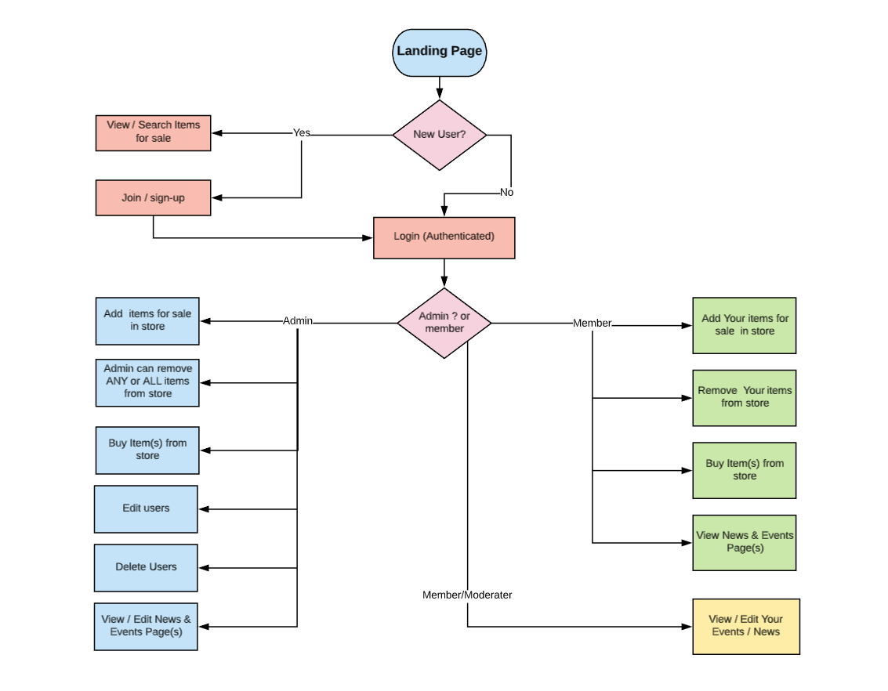

# README
## Ruby on Rails Project : DARTHUB
### Created by: Peter Margan

### Table of Contents 

#### Project List of Requirements 
* <a href="#R7"> (R7)</a> Identify the problem you’re trying to solve
by building this particular marketplace App?
* <a href="#R8"> (R8)</a> Why is it a problem that needs solving 
* (<a href="#R9"> (R9)</a> Link to App on Heroku
* <a href="#R10">(R10)</a> Link to Github Repo 

* <a href="#R11">(R11)</a> Description of your marketplace app (website), including:
  * <a href="#R11.1">(R11.1)</a>Purpose
  * <a href="#R11.2">(R11.2)</a>functionality/features
  * <a href="#R11.3">(R11.3)</a>Site Map
  * <a href="#R11.4">(R11.4)</a>Screenshots
  * <a href="#R11.5"> (R11.5)</a>Target Audience
  * <a href="#R11.6">(R11.6)</a>Tech Stack

* <a href="#R12">(R12)</a> User Stories
* <a href="#R13">(R13)</a>	Wireframes for your app
* <a href="#R14">(R14)</a> An ERD for your app
* <a href="#R15">(R15)</a>	Explain the different high-level components (abstractions) in your app
* <a href="#R16">(R16)</a>	Detail any third party services that your app will use
* <a href="#R17">(R17)</a>	Describe your projects models in terms of the relationships (active record associations) they have with each other
* <a href="#R18">(R18)</a>	Discuss the database relations to be implemented in your application
* <a href="#R19">(R19)</a>	Provide your database schema design
* <a href="#R20">(R20)</a>	Describe the way tasks are allocated and tracked in your project

**(R7) Identify the problem you’re trying to solve**
 * For darts players and enthusiasts,looking for a way to buy or to sell their darts or darting equipment. Since darts are expensive, yet most players are continually looking to get a "better dart" to suit their style of play.
 
 **(R8) Why is it a problem that needs solving**
  * Provides a **platform Just for them** that is not specifically available otherwise. There are facebook groups but not as good.This marketplace will allow them to sell their darts and darting associated goods to other like minded darts enthusiasts.

**(R9)**
 [Heroku link](http://petesdarthub.herokuapp.com/)

**(R10)**
 [Github link](https://github.com/pmargan/Darthub)

**(R11) Description of your marketplace app**

**(R11.1) Site Purpose**
For darts players and darting enthusiasts enabling them to buy or sell darts or other related darting equipment. (*If time allows an extra* would be a forum section where Players and Dart Clubs would have a common medium for promoting their upcoming competitions, events.)

**(R11.2) Functionality & Features**

Application allows any user to view items, although only authenticated users will be able to purchase items and can view and edit their 'cart', and then pay for their order using Stripe as a third party payment system. Authenticated users can set up a store, To sell their item(s). Store owners have the ability to upload an image, name, description, and price for each item. They can also remove their items.
Admins have permissions to edit and delete users, and store items via administrator only area. To moderate the site and remove any offensive material/items.

**(R11.3) Site Screenshots**

[//]: # (todo Site Screenshots go here)

**(R11.4) Site Map**

 **(R11.5) Target audience of website**
 * All darts players and enthusists looking for News and events information on their sport. Provides them a forum platform, to sell or swap their darts and darting associated goods with other like minded darts enthusists.

**(R11.6) Tech Stack** 
 * Ruby on Rails (RoR) as the framework for this application's development.
 
 * The base for each page was built using HTML5 and styled using CSS (utilising SCSS)
 
 * The application was deployed to Heroku, a _Platform as a Service_ provider, allowing me to build and run an application in _the cloud_.

 * Ruby Version: 2.6.3

 * Rails Version: 5.2.3

 * Database: PostgreSQL

 * Gems Used:

 * Bundler - Gem management system. Enables easy gem install, update and dependency mangement capabilities.

 * Devise - User authentication. User account and session creation, password encryption and email reset functionality.

 * Rolify - User authorisation. Allows user role creation, and resource access allocation depending on user role id e.g. *only admins can access user admin panel* with the ability to edit and remove user accounts.

 * Dotenv - Environment variable creation for development. Loads a .env file during rails server initialisation that holds sensitive information such as database passwords and API keys/secrets.

 * RSpec - A Domain Specific Language testing tool. For TDD (test driven development)Used to create tests that determine whether the HTML produced by developer and helper methods within RoR, functions as we expect it to.

 * Cloudinary - Cloud-based image and video management platform. Where uploaded images are delivered through their CDN (content delivery network), facilitates faster media load times regardless of user geolocation and saves having to keep large files such as pictures within a local database.

 * Stripe - Remote payment infrastructure. Payment solution stack, that takes transactions away from the scope of your web application, removing much of the liability that comes with handling sensitive information such as credit card details, and deals with the frustration of things like chargebacks. Encrypts user traffic, aligning with our model/approach to information security.

 **(R12) User Stories**

**(R13) Wireframes for your app**
[Wireframes(click to open PDF)]( ./docs/wireframes.pdf)
**(R14) An ERD for your app**

**(R15) Explain the different high-level components (abstractions) in your app**

**(R16) Detail any third party services that your app will use**
* Gems Used:
 * Cloudinary - Cloud-based image and video management platform. Where uploaded images are delivered through their CDN (content delivery network), facilitates faster media load times regardless of user geolocation and saves having to keep large files such as pictures within a local database.

 * Stripe - Remote payment infrastructure. Payment solution stack, that takes transactions away from the scope of your web application, removing much of the liability that comes with handling sensitive information such as credit card details, and deals with the frustration of things like chargebacks. Encrypts user traffic, aligning with our model/approach to information security.
I installed stripe but unfortunatly didn't have time to ipmliment it!

 * Heroku - Cloud web hosting services for deployment.

**(R17) Describe your projects models in terms of the relationships (active record associations) they have with each other**

User model Relationships:
  * has_many :orders
  * has_many :items
  * has_many :purchased_items, through: :orders, source: :items

Item Model Relationshhips:
  *  belongs_to :user
  * has_and_belongs_to_many :orders
  * has_one_attached :image

Order Model Relationships:
  * belongs_to :user
  * has_and_belongs_to_many :items

**(R18) Discuss the database relations to be implemented in your application**

**Devise:**   On a high-level creates the User Model and attributes are that it's able to register and authenticate, ability to recover passwords,allows details to be remembered via cookie, and validatable.

**User** can choose to *have many Items* relationship i.e. a user can  have many items for sale .  in this circumstance, a user can have 1 or many items for sale but *does not have to*.
A User  can have many orders. Through the use of the **JOIN** table *items_orders* and relationship **has_many :orders**
A user can make many different product orders. This relationship enables users to access their own previous order details by pulling all order table entries referencing for that specific user_id.

**Item** Belongs to a single user. relationship *belongs_to :user* and items can be on many orders  *has_and_belongs_to_many :orders*
 has_one_attached :image Lets the model to know to possibly (not definitely) expect an image in Active Storage. This relationship does not necessarily require an image to be attached

**Order** Model
*belongs_to :user* An order must belong to a given user. An order should not be allowed to exist without assocation with someone creating an order
*has_and_belongs_to_many :items* The other side of the *items_orders* joining table's relationship. An order should be allowed to have many different items. Without allowing many here an user would be limited to order a single product item at a time.

**items_orders**
RoR models do not allow for many to many relationships by default
To bypass this limitation we create many to many relationship by association via a joining table
Both ends of the many to many relationship reference the joining table model with a has_many relationship.

20. Provide an overview and description of your Testing process.
RSpec is a Ruby testing tool that is frequently used within a TDD environment for production applications. RSpec tests equality between expected and actual runtime code outcomes through assertations. For example, when a user signs in, that they are actually authenticated and have a valid session. I chose Rspec to do testing but unfortunatly didn't have enough time to implment it. 

Good controller/routes.rb routing is important to help to ensure that users cannot reach places that they are not supposed to have access to, but as mentioned before Rolify does help mitigate this in the event that this happens.

**(R19) Provide your database schema design**

ActiveRecord::Schema.define(version: 2019_11_10_014714) do

  # These are extensions that must be enabled in order to support this database
  enable_extension "plpgsql"

  create_table "active_storage_attachments", force: :cascade do |t|
    t.string "name", null: false
    t.string "record_type", null: false
    t.bigint "record_id", null: false
    t.bigint "blob_id", null: false
    t.datetime "created_at", null: false
    t.index ["blob_id"], name: "index_active_storage_attachments_on_blob_id"
    t.index ["record_type", "record_id", "name", "blob_id"], name: "index_active_storage_attachments_uniqueness", unique: true
  end

  create_table "active_storage_blobs", force: :cascade do |t|
    t.string "key", null: false
    t.string "filename", null: false
    t.string "content_type"
    t.text "metadata"
    t.bigint "byte_size", null: false
    t.string "checksum", null: false
    t.datetime "created_at", null: false
    t.index ["key"], name: "index_active_storage_blobs_on_key", unique: true
  end

  create_table "items", force: :cascade do |t|
    t.string "name"
    t.string "description"
    t.text "condition"
    t.decimal "price"
    t.string "image"
    t.bigint "user_id"
    t.datetime "created_at", null: false
    t.datetime "updated_at", null: false
    t.integer "quantity"
    t.index ["user_id"], name: "index_items_on_user_id"
  end

  create_table "items_orders", id: false, force: :cascade do |t|
    t.bigint "order_id"
    t.bigint "item_id"
    t.index ["item_id"], name: "index_items_orders_on_item_id"
    t.index ["order_id"], name: "index_items_orders_on_order_id"
  end

  create_table "orders", force: :cascade do |t|
    t.bigint "user_id"
    t.datetime "created_at", null: false
    t.datetime "updated_at", null: false
    t.integer "quantity"
    t.index ["user_id"], name: "index_orders_on_user_id"
  end

  create_table "roles", force: :cascade do |t|
    t.string "name"
    t.string "resource_type"
    t.bigint "resource_id"
    t.datetime "created_at", null: false
    t.datetime "updated_at", null: false
    t.index ["name", "resource_type", "resource_id"], name: "index_roles_on_name_and_resource_type_and_resource_id"
    t.index ["resource_type", "resource_id"], name: "index_roles_on_resource_type_and_resource_id"
  end

  create_table "users", force: :cascade do |t|
    t.string "user_name"
    t.string "first_name"
    t.string "last_name"
    t.string "street_number"
    t.string "street_name"
    t.string "city"
    t.string "state"
    t.string "email", default: "", null: false
    t.string "encrypted_password", default: "", null: false
    t.string "reset_password_token"
    t.datetime "reset_password_sent_at"
    t.datetime "remember_created_at"
    t.datetime "created_at", null: false
    t.datetime "updated_at", null: false
    t.index ["email"], name: "index_users_on_email", unique: true
    t.index ["reset_password_token"], name: "index_users_on_reset_password_token", unique: true
  end

  create_table "users_roles", id: false, force: :cascade do |t|
    t.bigint "user_id"
    t.bigint "role_id"
    t.index ["role_id"], name: "index_users_roles_on_role_id"
    t.index ["user_id", "role_id"], name: "index_users_roles_on_user_id_and_role_id"
    t.index ["user_id"], name: "index_users_roles_on_user_id"
  end

  add_foreign_key "active_storage_attachments", "active_storage_blobs", column: "blob_id"
  add_foreign_key "items", "users"
  add_foreign_key "items_orders", "items"
  add_foreign_key "items_orders", "orders"
  add_foreign_key "orders", "users"
end

**(R20) Describe the way tasks are allocated and tracked in your project**
created trello board with requirements and user stories. Working though each card untill done.

