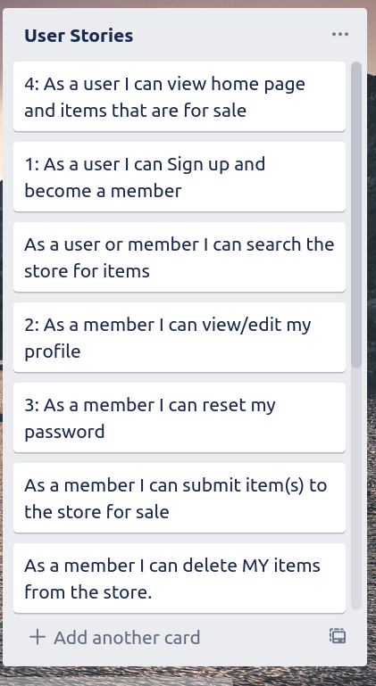
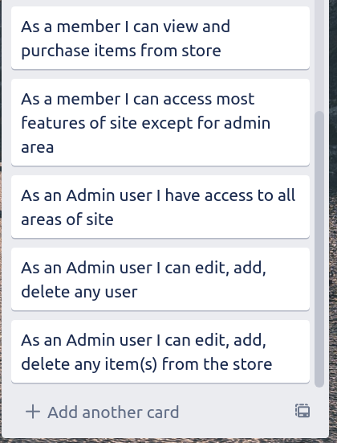
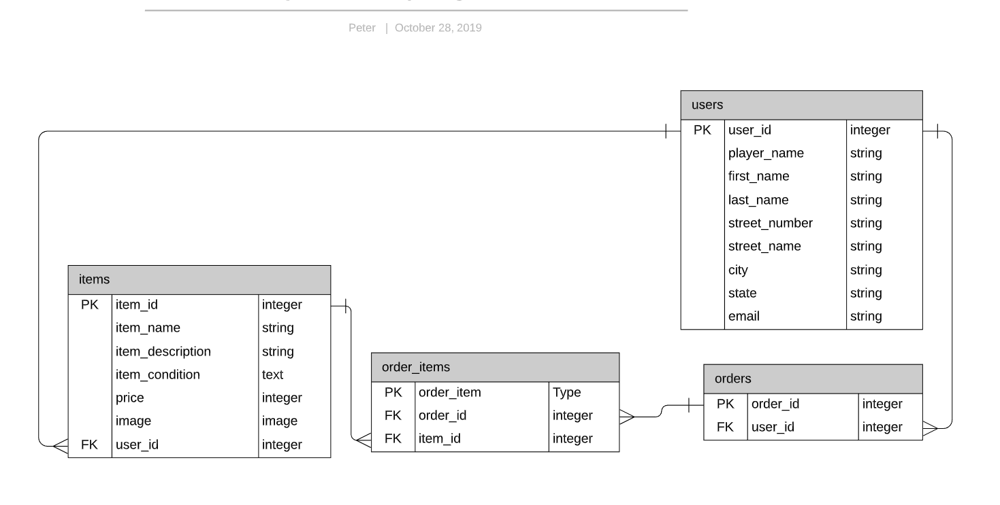

# README
## Ruby on Rails Project : DARTHUB
### Created by: Peter Margan

### Table of Contents 

#### Project List of Requirements 
* <a href="#R7"> (R7)</a> Identify the problem you’re trying to solve
by building this particular marketplace App?
* <a href="#R8"> (R8)</a> Why is it a problem that needs solving 
* (<a href="#R9"> (R9)</a> Link to App on Heroku
* <a href="#R10">(R10)</a> Link to Github Repo 

* <a href="#R11">(R11)</a> Description of your marketplace app (website), including:
  * <a href="#R11.1">(R11.1)</a>Purpose
  * <a href="#R11.2">(R11.2)</a>functionality/features
  * <a href="#R11.3">(R11.3)</a>Site Map
  * <a href="#R11.4">(R11.4)</a>Screenshots
  * <a href="#R11.5"> (R11.5)</a>Target Audience
  * <a href="#R11.6">(R11.6)</a>Tech Stack

* <a href="#R12">(R12)</a> User Stories
* <a href="#R13">(R13)</a>	Wireframes for your app
* <a href="#R14">(R14)</a> An ERD for your app
* <a href="#R15">(R15)</a>	Explain the different high-level components (abstractions) in your app
* <a href="#R16">(R16)</a>	Detail any third party services that your app will use
* <a href="#R17">(R17)</a>	Describe your projects models in terms of the relationships (active record associations) they have with each other
* <a href="#R18">(R18)</a>	Discuss the database relations to be implemented in your application
* <a href="#R19">(R19)</a>	Provide your database schema design
* <a href="#R20">(R20)</a>	Describe the way tasks are allocated and tracked in your project

**(R7) Identify the problem you’re trying to solve**
 * For darts players and enthusiasts,looking for a way to buy or to sell/trade their darts or darting equipment. Since darts are expensive, yet most players are continually looking to get a "better dart" to suit their style of play. Players and Dart Clubs also need a common medium for promoting their upcoming competitions, events and general darts news.
 
 **(R8) Why is it a problem that needs solving**
  * Provides a **platform Just for them** that is not specifically available otherwise. There are facebook groups but not as good.This marketplace will allow them to sell or swap their darts and darting associated goods with other like minded darts enthusiasts and keep up with up coming events in the greater darts community.

**(R9)**
 *todo add a link to heroku site here*

**(R10)**
 *todo add a link to github repo here*

**(R11) Description of your marketplace app**

**(R11.1) Site Purpose**
For darts players and darting enthusiasts enabling them to buy or trade their darts or other related darting equipment. Players and Dart Clubs will have a common medium for promoting their upcoming competitions, events.

**(R11.2) Functionality & Features**

Application allows any user to view items, although only authenticated users will be able to purchase items and can view and edit their 'cart', and then pay for their order using Stripe as a third party payment system. Authenticated users can set up a store, To sell OR swap their item(s). Store owners have the ability to upload an image, name, description, and price for each item. They can also remove their items.
Admins have permissions to edit and delete users, and store items via administrator only area. To moderate the site and remove any offensive material/items.

**(R11.3) Site Screenshots**

[//]: # (todo Site Screenshots go here)

**(R11.4) Site Map**

[//]: # (todo Site Map here)

 **(R11.5) Target audience of website**
 * All darts players and enthusists looking for News and events information on their sport. Provides them a forum platform, to sell or swap their darts and darting associated goods with other like minded darts enthusists.

**(R11.6) Tech Stack** 
 * Ruby on Rails (RoR) as the framework for this application's development.
 
 * The base for each page was built using HTML5 and styled using CSS (utilising SCSS)
 
 * The application was deployed to Heroku, a _Platform as a Service_ provider, allowing me to build and run an application in _the cloud_.
 
 * I used the Google Fonts API to import a nice font for styling.
 
 * Added Font Awesome CDN to import cool small icons into the app.

 * Ruby Version: 2.6.3

 * Rails Version: 5.2.3

 * Database: PostgreSQL

 * Gems Used:

 * Bundler - Gem management system. Enables easy gem install, update and dependency mangement capabilities.

 * Devise - User authentication. User account and session creation, password encryption and email reset functionality.

 * Rolify - User authorisation. Allows user role creation, and resource access allocation depending on user role id e.g. *only admins can access user admin panel* with the ability to edit and remove user accounts.

 * Dotenv - Environment variable creation for development. Loads a .env file during rails server initialisation that holds sensitive information such as database passwords and API keys/secrets.

 * RSpec - A Domain Specific Language testing tool. For TDD (test driven development)Used to create tests that determine whether the HTML produced by developer and helper methods within RoR, functions as we expect it to.

 * Cloudinary - Cloud-based image and video management platform. Where uploaded images are delivered through their CDN (content delivery network), facilitates faster media load times regardless of user geolocation and saves having to keep large files such as pictures within a local database.

 * Stripe - Remote payment infrastructure. Payment solution stack, that takes transactions away from the scope of your web application, removing much of the liability that comes with handling sensitive information such as credit card details, and deals with the frustration of things like chargebacks. Encrypts user traffic, aligning with our model/approach to information security.

 **(R12) User Stories**

**(R13) Wireframes for your app**
  #todo add wireframes here
**(R14) An ERD for your app**

**(R15) Explain the different high-level components (abstractions) in your app**

**(R16) Detail any third party services that your app will use**

**(R17) Describe your projects models in terms of the relationships (active record associations) they have with each other**

**(R18) Discuss the database relations to be implemented in your application**

**(R19) Provide your database schema design**

**(R20) Describe the way tasks are allocated and tracked in your project**

devise
Describes the attributes that Devise has with the User model. On a high-level these attributes are that they are able to register and authenticate, able to recover their password, allow their details to be remembered via cookie, and validatable.
has_one :store
A user can choose to have a store. has_one specifies a one-to-one relationship i.e. a user can only have one store. Without specific validation it allows the user to exist without any link to a store i.e. in this circumstance, a user can have a store, but does not have to.
has_many :orders
A user can make many different product orders. This relationship enables users to access their own previous order details by pulling all order table entries referencing for that specific user_id
Store Model
belongs_to :user
A store must belong to a user. For a entry to be created in the Store table, it must reference a user_id. This means a person visiting the site cannot create a store without first creating a regular user account. This provides a layer of authentication and prevents stores from easily being spam created.
has_many :products
A store can have many products. This relationship is relatively self-explanatory. Any store should be able to stock many different items. Any other relationship would not really make sense here.
Product Model
belongs_to :store & validates :store_id, presence: true
A product must belong to a store. A guest user cannot create a identity-less product. validate :store_id will not allow product creation to proceed even if a guest user was somehow able to access the product creation (which routing should not allow them to do).
has_many :product_orders
Allows the same product_id to exist many times in the ProductOrder joining table. A product may be in many different orders, as you would expect many different users to be ordering the same product. If a user did not want more than one to be sold, we plan in future iterations to allow quantity of stock to be an entry in the Product table.
delegate :store_name, to :store
A small helper which changes the output of the .store method when called on a product. This will delegate that attribute from store_id to store_name, allowing us to easily call @product.store rather than @product.store_name and receive the stores name as output. This was only possible as we did not really need the store_id (the normal output from @product.store) in the view at all as an attribute of a given product's store.
has_one_attached :image
Lets the model to know to possibly (not definitely) expect an image in Active Storage. This relationship does not necessarily require an image to be attached, but in our instance one is forcibly put there. This maps sets up a one to one relationship between active_storage.service file and the Product model.
after_commit :has_image, on [:create, :update]
This object callback allows us to access the object being created or updated just prior to it bring saved. This specific callback checks the file after an object creation or update for an image attachment. Unless it finds an image attached it will add a default one from our asset pipeline. The associated helper method is shown below:
def has_image
    unless image.attached?
        self.image.attach(io: File.open(Rails.root.join('app', 'assets', 'images', 'placeholder.png')), filename: 'placeholder.png', content_type: 'image/png')
    end
end
Order Model
has_one :user
An order must belong to a given user. An order should not be allowed to exist without assocation with someone purchasing said order.
has_many :store_orders
The other side of the StoreOrder joining table's relationship. An order should be allowed to have many different products. Without allowing many here an user would be limited to order a single product at a time.
ProductOrder Model
RoR models do not allow for many to many relationships by default
To bypass this limitation we create many to many relationship by association via a joining table
Both ends of the many to many relationship reference the joining table model with a has_many relationship, as described in the respective model above.
Here we include a belongs_to for both models i.e. Product & Order to complete this relationship and connect the two Models with a many to many relationship.
Role Model
has_and_belongs_to_many :users, :join_table => :users_roles
Rolify creates its on UsersRoles table that contains the authorisation data for the User model. This appends that tables information to the User table object information and describes a relationship where a user may have and belong to set roles in the UserRoles table such as admin.
Common Among Models
resourcify
Identifies the resource models that you wish Rolify roles applied to.
Test Driven Development (SAQ 20)
20. Provide an overview and description of your Testing process.

Test Driven Development (TDD) is as a concept describes a development process whereby tests are created before the code that they are actually testing. This encourages developers to produce concise, elegant, and functinoal code that simply fulfils the requirements of their testing (which in turn describe their design requirements).

RSpec is a Ruby testing tool that is frequently used within a TDD environment for production applications. RSpec tests equality between expected and actual runtime code outcomes through assertations. For example, when a user signs in, that they are actually authenticated and have a valid session. We chose RSpec as our testing solution for this assessment.

Handling credit card information remotely with Stripe creates far less of a headache for developers as no credit card information ever hits their server.

Good controller/routes.rb routing is important to help to ensure that users cannot reach places that they are not supposed to have access to, but as mentioned before Rolify does help mitigate this in the event that this happens.

The Australian Privacy Act of 1988 requires that websites post a privacy policy, and contain multiple privacy rights that users are entitled to such as, 'how data is collected, stored and with whom it can be disclosed.' Recently Australian legislation was passed that required companies have a method to grant federal agencies (provided they are granted access by a court) access to any encrypted information.

Any company that has European users must also abide by the General Data Protection Regulation in 2018, replacing Data Protection Directive. It is an extensive set of regulations but one of the primary tenants is that users must be able to have their data removed at their request.